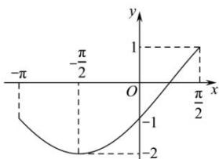

> [!faq]- 全练一本通解析
> **【解析】**
> （1） $\omega = 2$ , $\varphi = -\frac{\pi}{6}$ ; （2）答案见解析 解析: （1）根据题意得, $\frac{T}{4} = \frac{\pi}{4}$ , 故 $T = \pi$ , $\omega = \frac{2\pi}{T} = 2$ , 故 $f(x) = 2\cos (2x + \varphi)$ . 将 $A\left(-\frac{5\pi}{12}, -2\right)$ 代入, 得 $2 \times \left(-\frac{5\pi}{12}\right) + \varphi = -\pi + 2k\pi (k \in \mathbb{Z})$ , 解得 $\varphi = -\frac{\pi}{6} + 2k\pi (k \in \mathbb{Z})$ , 又 $|\varphi| < \frac{\pi}{2}$ , 故 $\varphi = -\frac{\pi}{6}$ . （2）依题意, $g(x) = 2\cos \left[\frac{2}{3} (x - \frac{3\pi}{4}) - \frac{\pi}{6}\right] = 2\cos \left(\frac{2}{3} x - \frac{2\pi}{3}\right)$ . 函数 $y = g(x) - a$ 在区间 $\left[-\pi, \frac{\pi}{2}\right]$ 的零点个数即为函数 $g(x)$ 的图象与直线 $y = a$ 在 $\left[-\pi, \frac{\pi}{2}\right]$ 上的交点个数. 当 $x \in \left[-\pi, \frac{\pi}{2}\right]$ 时, $\frac{2}{3} x - \frac{2\pi}{3} \in \left[-\frac{4\pi}{3}, -\frac{\pi}{3}\right]$ , 结合余弦函数图象可知, 当 $x \in \left[-\pi, -\frac{\pi}{2}\right]$ 时, $g(x)$ 单调递减, 当 $x \in \left(-\frac{\pi}{2}, \frac{\pi}{2}\right]$ 时, $g(x)$ 单调递增, 且 $g(-\pi) = -1$ , $g\left(\frac{\pi}{2}\right) = 1$ , $g\left(-\frac{\pi}{2}\right) = -2$ , 作出函数 $g(x)$ 在 $\left[-\pi, \frac{\pi}{2}\right]$ 上的大致图象如图所示.
> 
> 观察可知, 当 a = -2 或 $-1 < a \leq 1$ 时, $y = g(x) - a$ 有 1 个零点;
> 当 $-2 < a \leq -1$ 时， $y = g(x) - a$ 有 2 个零点；
> 当 a < -2 或 a > 1 时， $y = g(x) - a$ 有 0 个零点.
