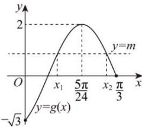

> [!faq]- 全练一本通解析
> **【解析】**
> (1) $f(x)=2\sin\left(2x-\frac{\pi}{3}\right)$ ; (2) $x_{1}+x_{2}=\frac{5\pi}{12}$
> 解析：（1）设 $f(x)$ 的最小正周期为 $T$ ，则 $\frac{T}{2} = \frac{2\pi}{3} -\frac{\pi}{6} = \frac{\pi}{2}$ ，可得 $T = \frac{2\pi}{|\omega|} = \pi$ ，且 $\omega >0$ ，解得 $\omega = 2$ ，由图象可知：当 $x = \frac{\frac{2\pi}{3} + \frac{\pi}{6}}{2} = \frac{5\pi}{12}$ 时， $f(x)$ 取到最大值，且 $A > 0$ ，则 $f\left(\frac{5\pi}{12}\right) = A\sin \left(\frac{5\pi}{6} +\varphi\right) = A$ ，可得 $\frac{5\pi}{6} +\varphi = 2k\pi +\frac{\pi}{2},k\in \mathbf{Z}$ ，解得 $\varphi = 2k\pi -\frac{\pi}{3},k\in \mathbf{Z}$ 又因为 $-\frac{\pi}{2} <  \varphi <  \frac{\pi}{2}$ ，可得 $k = 0,\varphi = -\frac{\pi}{3}$ ，则 $f(x) = A\sin \left(2x - \frac{\pi}{3}\right)(A > 0)$ 且 $f(x)$ 的图象过点 $(0, - \sqrt{3})$ ，则 $f(0) = A\sin \left(-\frac{\pi}{3}\right) = -\frac{\sqrt{3}}{2} A = -\sqrt{3}$ ，解得 $A = 2$ ，所以 $f(x) = 2\sin \left(2x - \frac{\pi}{3}\right).$ （2）令 $g(x) = f(2x) = 2\sin \left(4x - \frac{\pi}{3}\right)$ 由 $y = f(2x) - m = 0$ ，可得 $f(2x) = m$ 可知 $y = f(2x) - m$ 的零点等价于 $y = g(x)$ 与 $y = m$ 的图象交点横坐标，且 $g(0) = 2\sin \left(-\frac{\pi}{3}\right) = -\sqrt{3},g\left(\frac{5\pi}{24}\right) = 2\sin \frac{\pi}{2} = 2,g\left(\frac{\pi}{3}\right) = 2\sin \pi = 0$ 作出 $y = g(x)$ 在 $\left[0,\frac{\pi}{3}\right]$ 内的图象，不妨设 $x_{1} <   x_{2}$ ，如图所示：
> 
> 由图象可知： $0 \leq m < 2$ ，且 $\left(x_{1}, g\left(x_{1}\right)\right), \left(x_{2}, g\left(x_{2}\right)\right)$ 关于直线 $x = \frac{5\pi}{24}$ 对称，所以 $x_{1} + x_{2} = 2 \times \frac{5\pi}{24} = \frac{5\pi}{12}$
