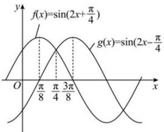

> [!faq]- 全练一本通解析
> **【答案】** BCD
>
> **【解析】**
> 解析:依题意可得, $2\times\frac{\pi}{8}+\varphi=\frac{\pi}{2}+k\pi,(k\in Z)$ , 即 $\varphi=\frac{\pi}{4}+k\pi,(k\in Z)$ ,
> 因为 $0<\varphi<\pi$ ，所以 $\varphi=\frac{\pi}{4}$ ，故 $f(x)=\sin\left(2x+\frac{\pi}{4}\right)$ .
> 因为 $f\left(x+\frac{\pi}{8}\right)=\sin\left(2x+\frac{\pi}{2}\right)=\cos2x$ ，所以 $f\left(x+\frac{\pi}{8}\right)$ 是偶函数，故选项 A 错误；
> 因为 $f\left(\frac{3\pi}{8}\right)=\sin\left(2\times\frac{3\pi}{8}+\frac{\pi}{4}\right)=\sin\pi=0$ ，故选项 B 正确；
> 由 $\frac{\pi}{2} + 2k\pi \leq 2x + \frac{\pi}{4} \leq \frac{3\pi}{2} + 2k\pi$ , $k \in Z$ , 得 $\frac{\pi}{8} + k\pi \leq x \leq \frac{5\pi}{8} + k\pi$ , $k \in Z$ ,
> 所以 $f(x)$ 在 $\left[\frac{\pi}{8}+k\pi,\frac{5\pi}{8}+k\pi\right]$ , $k \in Z$ 上单调递减，
> 因为 $\left[\frac{\pi}{8},\frac{\pi}{2}\right]\subset\left[\frac{\pi}{8},\frac{5\pi}{8}\right]$ ，故选项 C 正确；
> 作出 $y=f(x)$ 和 $y=g(x)$ 的图象，
> 
> 由图可知, 选项 D 正确.
>
> 故选 **BCD**
