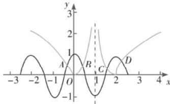

> [!faq]- 全练一本通解析
> **【答案】** 4
>
> **【解析】**
> 作 $g(x)=\left|\log_{2}\left|x-1\right|\right|$ 和 $f(x)=\cos\pi x$ 的图象, 共有 A, B, C, D 这 4 个交点, 由中点坐标公式可得: $x_{A}+x_{D}=2$ , $x_{B}+x_{C}=2$ , 故所有交点的横坐标之和为 4
> 
> 故答案为:4
