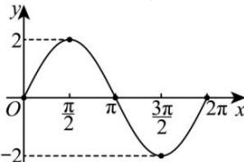

> [!faq]- 全练一本通解析
> **【答案】** 详见解析
>
> **【解析】**
> （1）列表：
> <table><tr><td>x</td><td>0</td><td> $\frac{\pi}{2}$ </td><td> $\pi$ </td><td> $\frac{3\pi}{2}$ </td><td> $2\pi$ </td></tr><tr><td> $\sin x$ </td><td>0</td><td>1</td><td>0</td><td>-1</td><td>0</td></tr><tr><td> $2\sin x$ </td><td>0</td><td>2</td><td>0</td><td>-2</td><td>0</td></tr></table>
> 描点、连线、绘图, 如图所示.
> 
> 定义域： $x\in \mathbf{R}$
> 值域： $[-2,2]$
> 最小正周期: $T=2\pi$
> 单调递增区间： $\left[-\frac{\pi}{2} + 2k\pi, \frac{\pi}{2} + 2k\pi\right], k \in \mathbf{Z}$
> 单调递减期间： $\left[\frac{\pi}{2} + 2k\pi, \frac{3\pi}{2} + 2k\pi\right], k \in \mathbf{Z}$
> 对称轴： $x = \frac{\pi}{2} + k\pi$ ， $k\in \mathbf{Z}$
> 对称中心： $(k\pi ,0)$ ， $k\in \mathbf{Z}$
> 图像变换: $y=2\sin x$ 的图像是由 $y=\sin x$ 横坐标保持不变, 纵坐标伸长为原来的 2 倍.
