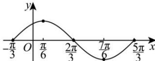

> [!faq]- 全练一本通解析
> **【解析】**
> 详见解析
> 解析:令 $X=x+\frac{\pi}{3}$ ，则 $x=X-\frac{\pi}{3}$ ，列表，描点画图（如图）.
> 列表:
> <table><tr><td>X</td><td>0</td><td> $\frac{\pi}{2}$ </td><td> $\pi$ </td><td> $\frac{3\pi}{2}$ </td><td> $2\pi$ </td></tr><tr><td>x</td><td> $-\frac{\pi}{3}$ </td><td> $\frac{\pi}{6}$ </td><td> $\frac{2\pi}{3}$ </td><td> $\frac{7\pi}{6}$ </td><td> $\frac{5\pi}{3}$ </td></tr><tr><td> $\sin\left(x+\frac{\pi}{3}\right)$ </td><td>0</td><td>1</td><td>0</td><td>-1</td><td>0</td></tr></table>
> 描点连线如图.
> 
> 定义域: $x \in \mathbf{R}$
> 值域： $[-1,1]$
> 最小正周期： $T=2\pi$
> 单调递增区间: $\left[-\frac{5\pi}{6}+2k\pi,\frac{\pi}{6}+2k\pi\right],k\in\mathbf{Z}$ ;
> 单调递减期间： $\left[\frac{\pi}{6} +2k\pi ,\frac{7\pi}{6} +2k\pi \right],k\in \mathbf{Z}$
> 对称轴： $x = \frac{\pi}{6} + k\pi$ ， $k\in \mathbf{Z}$
> 对称中心: $\left(-\frac{\pi}{3}+k\pi,0\right)$ ， $k\in Z$
> 图像变换： $y = \sin \left(x + \frac{\pi}{3}\right)$ 的图像是由 $y = \sin x$ 图像向左平移 $\frac{\pi}{3}$ 个单位长度得到.
