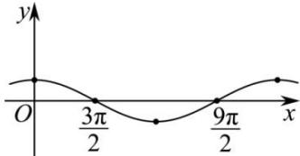

> [!faq]- 全练一本通解析
> **【答案】** 详见解析
>
> **【解析】**
> 今 $X=\frac{x}{}$ ，则 x=3X，列表.描点画图（如图）.
> $$
> X = \frac {x}{3}
> $$
> <table><tr><td>X</td><td>0</td><td> $\frac{\pi}{2}$ </td><td> $\pi$ </td><td> $\frac{3\pi}{2}$ </td><td> $2\pi$ </td></tr><tr><td>x</td><td>0</td><td> $\frac{3\pi}{2}$ </td><td> $3\pi$ </td><td> $\frac{9\pi}{2}$ </td><td> $6\pi$ </td></tr><tr><td> $\cos\frac{1}{3}x$ </td><td>1</td><td>0</td><td>-1</td><td>0</td><td>1</td></tr></table>
> 描点连线, 如图所示;
> 
> 定义域: $x \in \mathbf{R}$
> 值域：[-1,1]
> 最小正周期： $T = 6\pi$
> 单调递增区间： $\left[3\pi +6k\pi ,6\pi +6k\pi \right],k\in \mathbf{Z}$
> 单调递减期间： $\left[6k\pi ,3\pi +6k\pi \right],k\in \mathbf{Z}$
> 对称轴： $x = 3k\pi$ ， $k\in \mathbf{Z}$
> 对称中心: $\left(\frac{3\pi}{2}+3k\pi,0\right)$ ， $k\in Z$
> 图像变换: $y = \cos \frac{1}{3} x$ 的图像是由 $y = \cos x$ 图像纵坐标不变, 横坐标扩大为原来的 3 倍得到.
