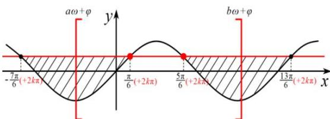
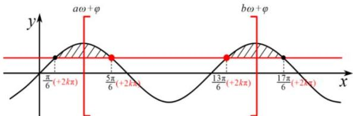

<!-- question-source:start -->
【34】已知 $f(x) = \sin \left(\omega x + \frac{\pi}{3}\right)(\omega >0)$ 在 $\left(\frac{\pi}{3},\pi\right)$ 上恰有1个零点，则 $\omega$ 的取值范围是（）A. $\left(0,\frac{2}{3}\right)\cup \left[\frac{5}{3},\frac{8}{3}\right]$ B. $\left(\frac{2}{3},\frac{5}{3}\right)\cup \left[2,\frac{8}{3}\right]$ C. $\left[\frac{5}{3},2\right)\cup \left[\frac{8}{3},\frac{11}{3}\right]$ D. $(0,2]\cup \left[\frac{8}{3},\frac{11}{3}\right]$

$$
3: y = \sin (w x + \varphi) = t
$$

这类题目相对来说更为复杂,一般讨论两种情况,
这里举例: $\sin(wx+\varphi)=\frac{1}{2}$ 在 $(a,b)$ 有两个零点:

<!-- question-source:end -->

![[Q00004727A1]]
