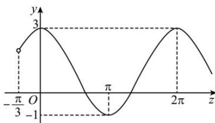

> [!faq]- 全练一本通解析
> **【答案】** A
>
> **【解析】**
> 解析: 因为 $x \in (0, 2\pi)$ ， $\omega > 0$ ，令 $\alpha = \omega x - \frac{\pi}{3}$ ，所以 $\omega x - \frac{\pi}{3} \in \left(-\frac{\pi}{3}, 2\omega \pi - \frac{\pi}{3}\right)$ ，画出 $y = 2\cos \alpha + 1$ 的图象要想图象在区间 $(0, 2\pi)$ 内至多存在 3 条对称轴，则 $2\omega \pi - \frac{\pi}{3} \in \left(-\frac{\pi}{3}, 3\pi\right]$ ，解得 $\omega \in \left(0, \frac{5}{3}\right]$ 。故选：A
> 
