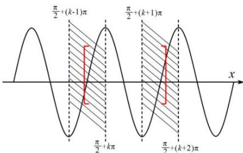

> [!faq]- 全练一本通解析
> **【答案】** A
>
> **【解析】**
> 解析：令 $\alpha = \omega x + \frac{\pi}{3}$ ，因为 $x \in \left[\frac{\pi}{3}, \pi\right]$ ，所以 $\alpha \in \left[\frac{\pi}{3}\omega + \frac{\pi}{3}, \pi\omega + \frac{\pi}{3}\right]$ ，原题等价于 $y = \sin\alpha$ 在 $\alpha \in \left[\frac{\pi}{3}\omega + \frac{\pi}{3}, \pi\omega + \frac{\pi}{3}\right]$ 恰好有两条对称轴，区间的具体位置不定，根据图示，区间只能位于阴影区域.
> 
> 根据图示列出不等式组 $\left\{\frac{\pi}{2}+(k-1)\pi<\frac{\pi}{3}\omega+\frac{\pi}{3}\leq\frac{\pi}{2}+k\pi\right.$ ，4 组不等式取交集且不为空集，所以 k=1 或 k=2。当 k=1 时， $\frac{13}{6}\leq\omega<\frac{19}{6}$ ；当 k=2 时， $\frac{7}{2}<\omega<\frac{25}{6}$ 。
>
> 故选 **A**.
