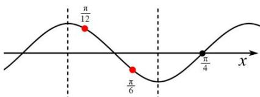

> [!faq]- 全练一本通解析
> **【答案】** C
>
> **【解析】**
> 解析: 方法一:
> ∵ 函数 $f(x) = \sin (\omega x + \varphi)\left(\omega > 0, |\varphi| \leqslant \frac{\pi}{2}\right), x = -\frac{\pi}{4}$ 为 $y = f(x)$ 图象的对称轴， $x = \frac{\pi}{4}$ 为 $f(x)$ 的零点， $f(x)$ 在区间 $\left(\frac{\pi}{12}, \frac{\pi}{6}\right)$ 上单调，∴ 周期 $T \geqslant 2 \times \left(\frac{\pi}{6} - \frac{\pi}{12}\right) = \frac{\pi}{6}$ ，即 $\frac{2\pi}{\omega} \geqslant \frac{\pi}{6}, \therefore \omega \leqslant 12$ 。
> ∵ $x = -\frac{\pi}{4}$ 为 $y = f(x)$ 图象的对称轴， $x = \frac{\pi}{4}$ 为 $f(x)$ 的零点，
> \$\therefore \frac{2n+1}{4} \cdot \frac{2\pi}{\omega} = \frac{\pi}{2}, n \in Z, \therefore \omega = 2n+1\$。
> （1）当 \$\omega = 11\$ 时，由题意可得 $\frac{\pi}{4} \times 11 + \varphi = k\pi, \varphi = \frac{\pi}{4}$ ，函数为 $y = f(x) = \sin\left(11x + \frac{\pi}{4}\right)$ ,
> 在区间 $\left(\frac{\pi}{12}, \frac{\pi}{6}\right)$ 上， $11x + \frac{\pi}{4} \in \left(\frac{7\pi}{6}, \frac{25\pi}{12}\right), f(x)$ 在区间 $\left(\frac{\pi}{12}, \frac{\pi}{6}\right)$ 上不单调，\$\therefore \omega \neq 11\$。
> （2）当 \$\omega = 9\$ 时，由题意可得 $\frac{\pi}{4} \times 9 + \varphi = k\pi, \varphi = -\frac{\pi}{4}$ ，函数为 $y = f(x) = \sin\left(9x - \frac{\pi}{4}\right)$ ,
> 在区间 $\left(\frac{\pi}{12}, \frac{\pi}{6}\right)$ 上， $9x - \frac{\pi}{4} \in \left(\frac{\pi}{2}, \frac{5\pi}{4}\right), f(x)$ 在区间 $\left(\frac{\pi}{12}, \frac{\pi}{6}\right)$ 上单调，满足条件，
> 则 \$\omega\$ 的最大值为 9，故选：C
> 方法二:
> ∵ $x = -\frac{\pi}{4}$ 为 $y = f(x)$ 图象的对称轴， $x = \frac{\pi}{4}$ 为 $f(x)$ 的零点，
> \$\therefore \frac{2n+1}{4} \cdot \frac{2\pi}{\omega} = \frac{\pi}{2}, n \in Z, \therefore \omega = 2n+ 1\$。
> 题中求 \$\omega\$ 的最大值，所以要求图像越“瘦”越满足题意
> 因为 $\frac{\pi}{6} - \frac{\pi}{12} = \frac{\pi}{12} \leqslantslant\frac{T}{2}$ ，所以 $T ≥slantslantslant$ ，因为对称轴和区间端点最近的间距
> \$\frac{\pi}{4} - \frac{\pi}{6} =slantslantslantslant T\$，所以在一个周期中且对称点\$\left(\frac{\pi}{4},0\right)\$ 最远可以在
> \$\left(\frac{\pi}{12},\frac{\pi}{6}\right)\$ 的下一个单调区间，画出图像进行分析。
> 
> 列出不等式组 $\left\{\begin{aligned}\frac{\pi}{4}-\frac{\pi}{12}&=\frac{\pi}{6}\leq\frac{3T}{4}\\ \frac{\pi}{4}-\frac{\pi}{6}&=\frac{\pi}{12}\geq\frac{T}{4}\end{aligned}\right.$ 解得 $6\leq w\leq9$ ，又因为 $\omega=2n+1,\left(n\in N\right)$ ，所以 $\omega=9$ ，经检验成立
