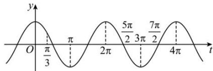

> [!faq]- 全练一本通解析
> **【答案】** D
>
> **【解析】**
> 解析: 令 $t = \omega x + \frac{\pi}{3}$ ，由 $x \in [0, 2\pi]$ ，则 $t \in \left[\frac{\pi}{3}, 2\pi\omega + \frac{\pi}{3}\right]$ ，又函数 $f(x)$ 在区间 $[0, 2\pi]$ 上有且仅有 3 个零点和 2 条对称轴，即 $y = 2\cos t$ 在区间 $\left[\frac{\pi}{3}, 2\pi\omega + \frac{\pi}{3}\right]$ 上有且仅有 3 个零点和 2 条对称轴，
> 作出 $y=2\cos t$ 的图象如下，
> 所以 $\frac{5\pi}{2}\leq2\pi\omega+\frac{\pi}{3}<3\pi$ ，得 $\omega\in\left[\frac{13}{12},\frac{4}{3}\right)$ 。故选：D.
> 
