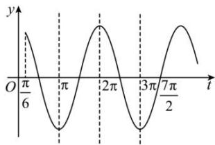

> [!faq]- 全练一本通解析
> **【答案】** A
>
> **【解析】**
> 解析:函数 $f(x)=2\cos\left(\omega x+\frac{\pi}{6}\right)(\omega>0)$ . 当 $x\in[0,\pi)$ 时,令 $t=\omega x+\frac{\pi}{6}$ ,则 $t\in\left[\frac{\pi}{6},\omega\notin+\frac{\pi}{6}\right)$ ,
> 若 $f(x)$ 在 $[0,\pi)$ 有且仅有3个零点和3条对称轴,则y=2cost在 $t\in\left[\frac{\pi}{6},\omega\notin+\frac{\pi}{6}\right)$ 有且仅有3个零点和3条对称轴,区间左端固定,只需研究区间右侧就行. 则 $3\pi<\omega\pi+\frac{\pi}{6}\leq\frac{7}{2}\pi$ , 解得 $\frac{17}{6}<\omega\leq\frac{10}{3}$ . 故选:A.
> 
