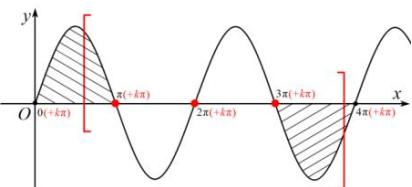

> [!faq]- 全练一本通解析
> **【答案】** C
>
> **【解析】**
> 解析：因为 $x\in [\frac{\pi}{3},\pi ]$ ， $\omega x + \frac{\pi}{3}\in [\frac{\pi}{3}\omega +\frac{\pi}{3},\pi \omega +\frac{\pi}{3} ]$ ，要想保证函数在 $\left[\frac{\pi}{3},\pi \right]$ 恰有三个零点，满足 $\left\{k\pi <  \frac{\pi}{3}\omega +\frac{\pi}{3}\leq \pi +k\pi \\ 3\pi +k\pi \leq \pi \omega +\frac{\pi}{3} <  4\pi +k\pi ,k\in Z,\text{即}\left\{\begin{array}{l} - 1 + 3k <   \omega \leq 2 + 3k\\ 8/3 + k\leq   \omega <  \frac{11}{3} +k\\ \end{array}\right.\right.$ 又 $\omega >0$ ，要使上述方程组有解，则需 $\left\{ \begin{array}{l} - 1 + 3k <   \frac{11}{3} +k\\ 8 / 3 + k\leq 2 + 3k\\ 2 + 3k > 0\\ 11 / 3 + k > 0 \\ \end{array} \right.$ （ $k\in Z$ )，解得 $1 / 3\leq k <   7 / 3$ （ $k\in Z$ )，故 $k = 1,2$ ，当 $k = 1$ 时， $11 / 3\leq   \omega <   14 / 3$ ，当 $k = 2$ 时， $5 <   \omega <   \frac{17}{3}$ ，综上： $\omega$ 的取值范围是 $\left[\frac{11}{3},\frac{14}{3}\right)\cup (5,\frac{17}{3})$ .故选：C.
> 
