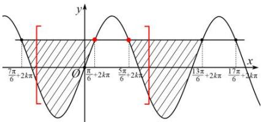
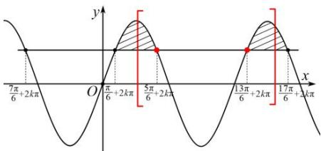

> [!faq]- 全练一本通解析
> **【答案】** $\frac{9}{2}<\omega\leq\frac{13}{2}$ 或 $\frac{7}{2}<\omega<4$
>
> **【解析】**
> 令 $\alpha=\omega x-\frac{\pi}{6}$ 当 $x\in\left(\frac{\pi}{4},\frac{2\pi}{3}\right)$ ， $\alpha=\omega x-\frac{\pi}{6}\in\left(\frac{\pi}{4}\omega-\frac{\pi}{6},\frac{2\pi}{3}\omega-\frac{\pi}{6}\right)$ 原式 $f(x)=2\sin\left(\omega x-\frac{\pi}{6}\right)-1=0$ 等价于 $\sin\left(\omega x-\frac{\pi}{6}\right)=\frac{1}{2}$ 原题等价于 $\sin\alpha=\frac{1}{2}$ 在 $\alpha\in\left(\frac{\pi}{4}\omega-\frac{\pi}{6},\frac{2\pi}{3}\omega-\frac{\pi}{6}\right)$ 恰有两个解，做出图像分析，即区间端点应分布在图中阴影区域，分两种情况进行讨论。
> 
> 
> 即列出不等式组① $\left\{\begin{aligned}-\frac{7\pi}{6}+2k\pi\leq\frac{\pi}{4}\omega-\frac{\pi}{6}<\frac{\pi}{6}+2k\pi\\\frac{5\pi}{6}+2k\pi<\frac{2\pi}{3}\omega-\frac{\pi}{6}\leq\frac{13\pi}{6}+2k\pi\end{aligned}\right.$ 或者② $\left\{\begin{aligned}\frac{\pi}{6}+2k\pi\leq\frac{\pi}{4}\omega-\frac{\pi}{6}<\frac{5\pi}{6}+2k\pi\\\frac{13\pi}{6}+2k\pi<\frac{2\pi}{3}\omega-\frac{\pi}{6}\leq\frac{17\pi}{6}+2k\pi\end{aligned}\right.$ 解得① $\left\{\begin{aligned}-4+8k\leq\omega<\frac{4}{3}+8k\\\frac{3}{2}+3k<\omega\leq\frac{7}{2}+3k\end{aligned}\right.$ 或者② $\left\{\begin{aligned}\frac{4}{3}+8k\leq\omega<4+8k\\\frac{7}{2}+3k<\omega\leq\frac{9}{2}+3k\end{aligned}\right.$ ，对于不等式组① k=1，解得 $\frac{9}{2}<\omega\leq\frac{13}{2}$ ，k 为其他值均无解。对于不等式组② k=0，解得 $\frac{7}{2}<\omega<4$ ，k 为其他值均无解。综上 $\frac{9}{2}<\omega\leq\frac{13}{2}$ 或 $\frac{7}{2}<\omega<4$ 。
