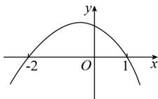

> [!faq]- 全练一本通解析
> **【解析】**
> (1)2; (2) $[- \frac {5}{11},1]$ 解析:(1)命题等价于不等式 $(1-a^{2})x^{2}+3(1-a)x+6\geq0$ 的解集为[-2,1]，显然 $1-a^{2}\neq0$ ，如图.
> 
> $\therefore 1 - a^2 < 0$ 且 $x_{1} = -2$ 、 $x_{2} = 1$ 是方程 $(1 - a^{2})x^{2} + 3(1 - a)x + 6 = 0$ 的两根， $\left\{ \begin{array}{l} x_{1} + x_{2} = \frac{3(a - 1)}{1 - a^{2}} = -1 \\ x_{1} \cdot x_{2} = \frac{6}{1 - a^{2}} = -2 \end{array} \right. \Rightarrow \left\{ \begin{array}{l} a^{2} - 3a + 2 = 0 \\ a^{2} = 4 \end{array} \right.$ ，解得： $a = 2$ 。（2）①若 $1 - a^{2} = 0$ ，即 $a = \pm 1$ 当 $a = 1$ 时， $f(x) = \sqrt{6}$ ，定义域为 $\mathbf{R}$ ，满足题意；当 $a = -1$ 时， $f(x) = \sqrt{6x + 6}$ ，定义域不为 $\mathbf{R}$ ，不满足题意；
> - **②**：若 $1 - a^{2} \neq 0$ ， $g(x) = (1 - a^{2})x^{2} + 3(1 - a)x + 6$ 为二次函数， $\because f(x)$ 定义域为 $\mathbf{R}$ ， $\therefore g(x) \geq 0$ 对 $x \in \mathbf{R}$ 恒成立， $\therefore \left\{ \begin{array}{l} 1 - a^{2} > 0 \\ \triangle = 9(1 - a)^{2} - 24(1 - a^{2}) \leq 0 \end{array} \right. \Rightarrow \left\{ \begin{array}{l} -1 < a < 1 \\ (a - 1)(11a + 5) \leq 0 \end{array} \right. \Rightarrow -\frac{5}{11} \leq a < 1$ 综合①、②得 $a$ 的取值范围 $[- \frac{5}{11}, 1]$ 。
