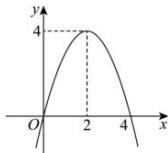

> [!faq]- 全练一本通解析
> **【解析】**
> [0,2]解析：画出函数 $f(x) = -x^2 + 4x$ 的图象，如下图所示：
> 
> $$
> f (0) = f (4) = 0, f (2) = 4
> $$
> $$
> m \in [ 0, 2 ]
> $$
> $$
> x \in \lceil m, 4 \rceil
> $$
> $$
> [ 0, 4 ]
> $$
