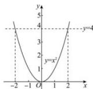

> [!faq]- 全练一本通解析
> **【答案】** AB
>
> **【解析】**
> 解析:画出 $y=x^{2}$ 的图象如下图所示,由 $x^{2}=4$ 解得 $x=\pm2$ , $f(x)=x^{2}$ 的图象是函数 $y=x^{2}$ 的图象的一部分，
> 依题意， $f(x)=x^{2}$ 的值域为 $[0,4]$ ，
> 由图可知， $f(x)$ 的定义域可以是 $[0,2]$ 、 $[-2,1]$ .
> 故选: AB
> 
