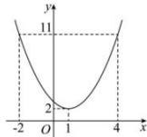

> [!faq]- 全练一本通解析
> **【答案】** AD
>
> **【解析】**
> 解析: 令 $x^{2}-2x+3=2$ ，解得 x=1，令 $x^{2}-2x+3=11$ ，解得 x=4 或 -2，可作出函数图象如图：
> 
> 设定义域为 M，所以 $\left[-2,1\right]\subseteq M$ 或 $\left[1,4\right]\subseteq M$ ，故 AD 正确，BC 错。
>
> 故选 **AD**.
