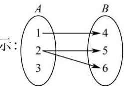

<!-- question-source:start -->
【5】（23·全国课堂例题）（多选）下列对应关系是集合 A 到集合 B 的函数的为（）
A. $A = R, B = \{y | y > 0\}, f : x \rightarrow y = |x|$ B. $A = Z, B = Z, f : x \rightarrow y = x^{2}$ C. $A = \{x \mid -1 \leq x \leq 1\}, B = \{0\}, f : x \rightarrow y = 0$ D. $A = \{1, 2, 3\}, B = \{4, 5, 6\}$ ，对应关系如图所

<!-- question-source:end -->
