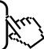

<!-- question-source:start -->
【6】(23·六安期中)(多选)下列对应不是集合 A 到集合 B 的函数的是（）
A. $A = B = R$ , $f: x \rightarrow y = 1$ B. $A = Z, B = Q, f: x \rightarrow y = \frac{1}{x}$ C. $A = B = N^{*}, f: x \rightarrow y = |x - 2|$ D. $A = B = R, f: x \rightarrow y = \pm \sqrt{x}$

<!-- question-source:end -->

![[Q00007490A1]]
