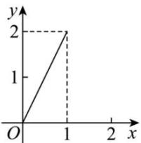
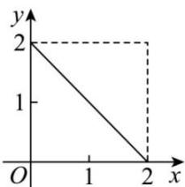
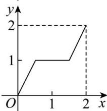
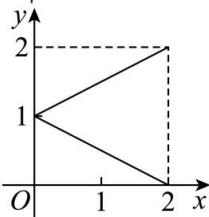

<!-- question-source:start -->
【9】（2023·江苏南京高一校考期中）（多选）设集合 $M=\left\{x\mid0\leq x\leq2\right\},N=\left\{y\mid0\leq y\leq2\right\}$ ，那么下列四个图形中，能表示集合M到集合N的函数关系得有（）

A.

B.

C.

D.

<!-- question-source:end -->
