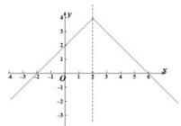

> [!faq]- 全练一本通解析
> **【答案】** A
>
> **【解析】**
> 解析:∵ $f(x+2)$ 是偶函数, ∴ 函数 $f(x)$ 关于 x=2 对称, ∴ $f(0)=f(4)=2$ , 又∵ $f(x)$ 在 $(-∞,2)$ 上单调递增, ∴ $f(x)$ 在 $(2,+∞)$ 单调递减, ∴ $f(4x-1)>2$ 可化为 0<4x-1<4, 解得 $\frac{1}{4}<x<\frac{5}{4}$ , ∴ 不等式 $f(4x-1)>2$ 解集为 $\left(\frac{1}{4},\frac{5}{4}\right)$ . 故选:A
> 
