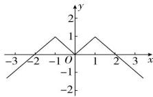

> [!faq]- 全练一本通解析
> **【答案】** 详见解析
>
> **【解析】**
> 由函数 $f(x)$ 是定义在 R 上的偶函数, 可知其图象关于 y 轴对称, 先描出 (1,1), (2,0) 关于 y 轴的对称点 (-1,1), (-2,0), 然后连线可得函数 $f(x)$ 的图象, 如图所示。 $xf(x)>0$ 即图象上横坐标、纵坐标同号, 结合函数 $f(x)$ 的图象可知， $xf(x)>0$ 的解集为 $(-∞,-2)∪(0,2)$ 。
> 
