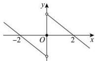

> [!faq]- 全练一本通解析
> **【解析】**
> $(-∞,-2]∪[0,2]$
> 解析:根据题意, $f(x)$ 为定义在R上的奇函数,则 $f(0)=0$ , $f(x)$ 为奇函数,且 $f(2)=0$ , $f(x)$ 在 $(-∞,0)$ 是减函数,
> ∴ $f(-2) = -f(2) = 0$ , $f(x)$ 在 $(0,+∞)$ 内是减函数,
> 函数图象草图如图, 则不等式 $f(x) \geq 0$ 的解集为 $(-∞,-2] ∪ [0,2]$ ;
> 
> 故答案为： $(-∞,-2]∪[0,2]$
