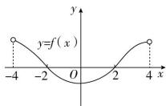
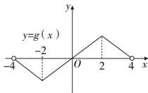

> [!faq]- 全练一本通解析
> **【解析】**
> $(-4,-2)\cup(0,2)$
> 解析: 补全函数 $f(x)$ , $g(x)$ 的图象如图所示, 由图可知, 当 -4 < x < -2 时, $f(x) > 0$ , $g(x) < 0$ , 此时 $f(x)g(x) < 0$ ; 当 0 < x < 2 时, $f(x) < 0$ , $g(x) > 0$ , 此时 $f(x)g(x) < 0$ .
> 故不等式 $f(x)g(x)<0$ 的解集是 $(-4,-2)\cup(0,2)$ .
> 
> 
