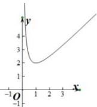
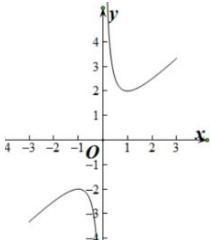

> [!faq]- 全练一本通解析
> **【答案】** (1) $[2, +\infty)$ ; (2) $(- \infty, -2] \cup [2, +\infty)$ ; (3) $[2, +\infty)$ ; (4) $[2\sqrt{2} - 1, +\infty)$ ; (5) $\left[\frac{11}{2}, 8\right]$ ; (6) $[-10, -8]$ ; (7) $\left[4, \frac{37}{3}\right]$ ; (8) $[3, +\infty)$ ; (9) $(- \infty, 2]$
>
> **【解析】**
> （1）由基本不等式可知 $y = x + \frac{1}{x} \geq 2\sqrt{x \cdot \frac{1}{x}} = 2, x \in (0, +\infty)$ ，当且仅当 $x = \frac{1}{x} = 1$ 时取等号. 故取值范围为： $[2, +\infty)$
> 
> （2）由 $y = x + \frac{1}{x}, x \in [-3,0) \cup (0,3]$ 的图像可知，当 $x = 1$ 时 $y = 2$ ；当 $x = -1$ 时 $y = -2$ 。故取值范围为： $(-\infty, -2] \cup [2, +\infty)$
> 
> （3）令 $t = x^2$ ，则 $y = t + \frac{1}{t} \geq 2\sqrt{t \cdot \frac{1}{t}} = 2, t \in (0, +\infty)$ ，当且仅当 $t = \frac{1}{t} = 1$ 时取等号. 故取值范围为： $[2, +\infty)$
> （4）令 $t = x + 1$ ，则 $y = t + \frac{2}{t} -1\geq 2\sqrt{t\cdot\frac{2}{t}} -1 = 2\sqrt{2} -1,t\in (1, + \infty)$ ，当且仅当 $t = \frac{2}{t} = \sqrt{2}$ 时取等号.故取值范围为 $[2\sqrt{2} -1, + \infty)$
> （5）由对勾函数性质可知，
> 当 $x \in \left[-\sqrt{7}, 0\right) \cup \left(0, \sqrt{7}\right]$ 时，函数值随 x 的增大而减
> 小， $x \in \left(-\infty, -\sqrt{7}\right] \cup \left[\sqrt{7}, +\infty\right)$ 时，函数值随 x 的增大而增大.
> 所以函数 $y = x + \frac{7}{x}$ 在 $x \in [1, 2]$ 上函数值随 x 的增大而减小 $\therefore 2 + \frac{7}{2} \leq y \leq 1 + 7$ ，即 $y \in \left[\frac{11}{2}, 8\right]$ .
> （6） $y=-2x-\frac{8}{x}=-\left(2x+\frac{8}{x}\right)$ ，由对勾函数性质可知，
> 当 $x \in [-2, 0) \cup (0, 2]$ 时，函数值随 x 的增大而增大， $x \in (-\infty, -2] \cup [2, +\infty)$ 时，函数值随 x 的增大而减小.
> 当 x=2 时， $y=-2\times2-\frac{8}{2}=-8$ . 又 x=1 时，y=-10,x=3 时 $y=-\frac{26}{3}>-10$ $\therefore -10 \leq y \leq -8$ . 所以 $y \in [-10, -8]$ （7）由对勾函数性质可知，
> 当 $x \in [-2, 0) \cup (0, 2]$ 时，函数值随 x 的增大而减小，
> 当 $x \in (-\infty, -2] \cup [2, +\infty)$ 时，函数值随 x 的增大而增大.
> ∴ 当 x=2 时，y=4. 当 $x=\frac{1}{3}$ 时， $y=\frac{37}{3}$ ，当 x=4 时，y=5>4. $\therefore 4 \leq y \leq \frac{37}{3}$ （8）令 $t = x^{2}, 0 < t < 1$ ，所以 $y = x^{2} + \frac{4}{x^{2}} - 2 = t + \frac{4}{t} - 2$ ，
> 因为对勾函数 $y = t + \frac{4}{t}$ 在 0 < t < 1 上单调递减，且没有最大值，
> 所以 $y = t + \frac{4}{t} > 1 + \frac{4}{1} = 5$ ，所以 $y = x^{2} + \frac{4}{x^{2}} - 2 > 5 - 2 = 3$ ，
> 所以取值范围为 $[3, +\infty)$ （9） $y=\frac{x^{2}-2x+2}{x-1}=\frac{(x-1)^{2}+1}{x-1}=x-1+\frac{1}{x-1}$ $\because -4 < x < 1, \therefore -5 < x - 1 < 0,$ 根据对勾函数图像和性质 $\therefore y = x - 1 + \frac{1}{x - 1} \leq -2,$ 所以 $y \in (-\infty, 2]$
