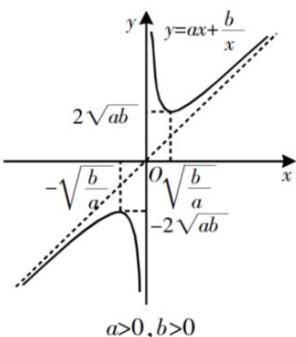

## 1. 双勾函数

对勾函数 $y = ax + \frac{b}{x} (ab > 0)$ 是一种类似于反比例函数的一般函数，它是由正比例函数 $y = ax (a \neq 0)$ 与反比例函数 $y = \frac{b}{x} (b \neq 0)$ “叠加”而成的函数.
当 a, b 同号时， $y = ax + \frac{b}{x} (ab > 0)$ 的图象形状酷似双勾. 故又被称为“双勾函数”“勾函数”等. 如图所示. 为了研究方便, 我们规定 a > 0, b > 0.

