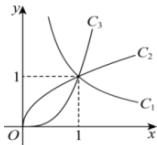

<!-- question-source:start -->
【18】图中 $C_{1}$ 、 $C_{2}$ 、 $C_{3}$ 为三个幂函数 $y = x^{\alpha}$ 在第一象限内的图象, 则式中指数 $\alpha$ 的值依次可以是（）

A. $\frac{1}{2}$ 、3、-1 B.-1、3、 $\frac{1}{2}$ C. $\frac{1}{2}$ 、-1、3 D.-1、 $\frac{1}{2}$ 、3
<!-- question-source:end -->
