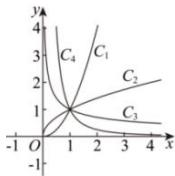

<!-- question-source:start -->
【19】如图的曲线是幂函数 $y = x^{n}$ 在第一象限内的图象. 已知 n 分别取 $\pm 2, \pm \frac{1}{2}$ 四个值, 与曲线 $C_{1}, C_{2}, C_{3}, C_{4}$ 相应的 n 依次为（）

A. $2, \frac{1}{2}, -\frac{1}{2}, -2$ B. $2, \frac{1}{2}, -2, -\frac{1}{2}$ C. $-\frac{1}{2}, -2, 2, \frac{1}{2}$ D. $-2, -\frac{1}{2}, \frac{1}{2}, 2$
<!-- question-source:end -->
