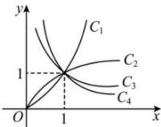

<!-- question-source:start -->
【20】已知幂函数 $y = x^{2}$ ， $y = x^{-1}$ ， $y = x^{\frac{1}{3}}$ ， $y = x^{-\frac{1}{2}}$ 在第一象限内的图象依次是如图中的曲线（）

A. $C_1, C_2, C_3, C_4$ B. $C_1, C_4, C_3, C_2$ C. $C_3, C_2, C_1, C_4$ D. $C_1, C_4, C_2, C_3$
<!-- question-source:end -->

![[Q00007854A1]]
