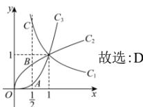

> [!faq]- 全练一本通解析
> **【答案】** D
>
> **【解析】**
> 解析: 在题给坐标系中, 作直线 $x=\frac{1}{2}$ , 分别交曲线 $a_{1}=1$ 于 A、B、C 三点则 $y_{A}<y_{B}<y_{C}$ , 又 $\left(\frac{1}{2}\right)^{3}=\frac{1}{8}<\frac{\sqrt{2}}{2}=\left(\frac{1}{2}\right)^{\frac{1}{2}}<2=\left(\frac{1}{2}\right)^{-1}$ 则点 A 在幂函数 $y = x^{3}$ 图像上，点 B 在幂函数 $y = x^{\frac{1}{2}}$ 图像上，
> 点 C 在幂函数 $y = x^{-1}$ 图像上，
> 则曲线 $C_{1}, C_{2}, C_{3}$ 对应的指数分别为 $-1, \frac{1}{2}, 3$
> 
