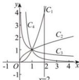

> [!faq]- 全练一本通解析
> **【答案】** A
>
> **【解析】**
> 解析: 因为函数 $y=2^{x}$ 为增函数, 所以 $2^{2}>2^{\frac{1}{2}}>2^{-\frac{1}{2}}>2^{-2}$ ,
> 所以作直线 x=2 分别与曲线 $C_{1}, C_{2}, C_{3}, C_{4}$ 相交，交点由上到下分别对应的 n 值为 $2, \frac{1}{2}, -\frac{1}{2}, -2$ ，由图可知，曲线 $C_{1}, C_{2}, C_{3}, C_{4}$ 相应 n 值为 $2,\frac{1}{2},-\frac{1}{2},-2$ . 故选:A
> 
