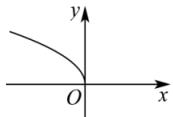
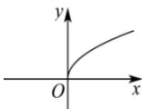
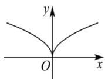
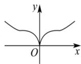

<!-- question-source:start -->
【23】(2023·浙江高一校联考期中)函数 $f(x)=|x|^{\frac{1}{2}}$ 的图象大致为（）

A.

（3）中间量法: 当底数不同且幂指数也不同时, 可选取适当的中间值, 比如: 0, 1 等, 与两数分别比较.

B.

C.

D.

<!-- question-source:end -->

![[Q00007857A1]]
