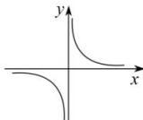
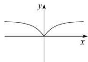
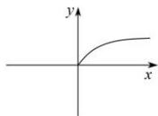
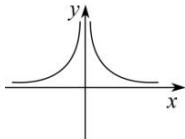
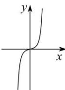
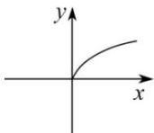
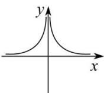
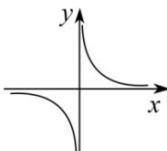

> [!faq]- 全练一本通解析
> **【答案】** 答案见解析
>
> **【解析】**
> （1） $y=x^{-3}=\frac{1}{x^{3}}$ ，其定义域为 $(-∞,0)∪(0,+∞)$ ，
> 又 $f(-x)=(-x)^{-3}=-x^{-3}=-f(x)$ 故 $y = x^{-3}$ 为定义域为 $(-∞,0) ∪ (0,+∞)$ 的奇函数；值域为 $(-∞,0) ∪ (0,+∞)$ 因为 a = -3，所以图像在第一象限为递减，图像如下图
> 
> (2) $y = x^{\frac{2}{3}} = \sqrt[3]{x^2}$ ，其定义域为 $R$ ，又 $f(-x) = (-x)^{\frac{2}{3}} = x^{\frac{2}{3}} = f(x)$ ，故 $y = x^{\frac{2}{3}}$ 为定义域为 $R$ 的偶函数。值域为 $[0, +\infty)$ 因为 $a = \frac{2}{3}$ ，所以图像在第一象限为增，且为横抛，图像如下图
> 
> （3）函数 $y=x^{\frac{1}{2}}$ 即 $y=\sqrt{x}$ ，其定义域是 $[0,+\infty)$ 。所以由奇函数、偶函数的定义可知，函数 $y=x^{\frac{1}{2}}$ 既不是奇函数，也不是偶函数。值域为 $[0,+\infty)$ 因为 $a=\frac{1}{2}$ ，所以图像在第一象限为增，且为横抛，图像如下图
> 
> （4）由函数 $y = x^{-2}$ 即 $y = \frac{1}{x^2}$ 可知 $x \neq 0$ ，所以此函数的定义域是 $(- \infty, 0) \cup (0, +\infty)$ 。因为对任意的 $x \in \mathbf{R}$ ， $x \neq 0$ ，都有 $-x \in \mathbf{R}$ ， $-x \neq 0$ ，且 $(-x)^{-2} = (-1)^{-2} \cdot x^{-2} = x^{-2}$ ，
> 所以由偶函数的定义知, 函数 $y = x^{-2}$ 是偶函数. 值域为 $(0, +\infty)$ 因为 a = -2 , 所以图像在第一象限为减, 图像如下图
> 
> （5） $y=x^{5}$ ，定义域为R，关于原点对称， $f(-x)=(-x)^{5}=-x^{5}$ ，函数为奇函数. 值域为 R
> 因为 a=5，所以图像在第一象限为增，且为竖抛，图像如下图
> 
> (6) $y = x^{\frac{5}{6}} = \sqrt[6]{x^5}$ ，定义域为 $[0, +\infty)$ ，不关于原点对称，函数为非奇非偶函数。值域为 $[0, +\infty)$ ，因为 $a = \frac{5}{6}$ ，所以图像在第一象限为增，且为横抛，图像如下图
> 
> (7) $y = x^{-\frac{4}{5}} = \frac{1}{\sqrt[5]{x^4}}$ 定义域为 $(-∞,0)∪(0,+∞)$ ,
> 关于原点对称, 且 $f(-x)=f(x)$ , 函数为偶函数.
> 因为 $a=-\frac{4}{5}$ ，所以图像在第一象限为减，图像如下图
> 
> （8） $y = x^{\frac{5}{3}} = \frac{1}{\sqrt[3]{x^5}}$ ，根据奇次根式性质，可得定义域： $(- \infty, 0) \cup (0, +\infty)$ ；由 $\frac{1}{\sqrt[3]{x^5}} \neq 0$ ，所以值域： $(- \infty, 0) \cup (0, +\infty)$ ；由 $g(x) = -g(-x)$ ，所以 $g(x)$ 为奇函数，图象关于原点对称；因为 $a = -\frac{5}{3}$ ，所以图像在第一象限为减，图像如下图
> 
