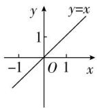
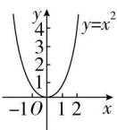
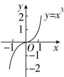
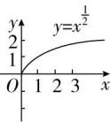
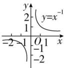

## 4. 五个常见幂函数的图象和性质

<table><tr><td></td><td> $y = x$ </td><td> $y = x^{2}$ </td><td> $y = x^{3}$ </td><td> $y = x^{\frac{1}{2}}$ </td><td> $y = x^{-1}$ </td></tr><tr><td>图像</td><td></td><td></td><td></td><td></td><td></td></tr><tr><td>定义域</td><td> $R$ </td><td> $R$ </td><td> $R$ </td><td> $[0, +\infty)$ </td><td> $(-\infty, 0) \cup (0, +\infty)$ </td></tr><tr><td>值域</td><td> $R$ </td><td> $[0, +\infty)$ </td><td> $R$ </td><td> $[0, +\infty)$ </td><td> $(-\infty, 0) \cup (0, +\infty)$ </td></tr><tr><td>奇偶性</td><td>奇函数</td><td>偶函数</td><td>奇函数</td><td>非奇非偶</td><td>奇函数</td></tr><tr><td>单调性</td><td>在 $R$ 上递增</td><td>在 $(-\infty, 0]$ 上递减在 $[0, +\infty)$ 上递增</td><td>在 $R$ 上递增</td><td>在 $[0, +\infty)$ 上递增</td><td>在 $(-\infty, 0), (0, +\infty)$ 上递减</td></tr><tr><td>定点</td><td colspan="5">(1,1)</td></tr></table>
