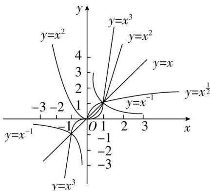

## 5. 幂函数的图像规律

（1）所有的幂函数在区间 $(0, +\infty)$ 上都有定义，因此在第一象限内都有图像，并且图像都通过点(1,1).

（2）如果 $\alpha > 0$ ，则幂函数的图像通过原点，并且在区间 $[0, +\infty)$ 上是增函数。当 $0 < \alpha < 1$ ，图像为横抛，当 $\alpha > 1$ ，图像为竖抛。当 $\alpha = 1$ ，图像为直线。

（3）如果 $\alpha < 0$ ，则幂函数在区间 $(0, +\infty)$ 上是减函数，且在第一象限内：当 x 从右边趋向于原点时，图像在 y 轴右方且无限地逼近 y 轴；当 x 无限增大时，图像在 x 轴上方且无限地逼近 x 轴。

6.形如 $f(x) = x^{\frac{n}{m}}$ （其中 $m \in N^{*}, n \in Z, m$ 与 $n$ 互质）的幂函数（可在学习完分数指数幂后来理解此结论）

(1) 任何幂函数在第一象限必有图象, 第四象限必无图象.

(2) n = 奇数/偶数时, 函数非奇非偶, 图象只在第一象限.

(3) n = 偶数/奇数时, 函数是偶函数、图象在第一、二象限并关于 y 轴对称.

(4) n = 奇数/奇数时, 函数是奇函数, 图象在第一、三象限并关于原点对称.

(5) 当 n<0 时, 图像与 x 轴, y 轴没有交点.

总结:对于上述结论,要重在理解,若理解困难,可将幂函数 $y=x^{\frac{m}{n}},y=x^{-\frac{m}{n}}(n,m\in N_{+}$ ,且 n,m 互质) 可分别化为: $y=\sqrt[n]{x^{m}},y=\frac{1}{\sqrt[n]{x^{m}}}$ ,根据分数指数幂的性质和结论,研究幂函数图像和性质.

例如： $y = x^{\frac{2}{3}}$ ，因为 $\alpha = \frac{2}{3}$ ，所以幂函数的图像通过原点，并且在区间 $[0, +\infty)$ 上是增函数，并且图像为横抛， $y = x^{\frac{2}{3}} = \sqrt[3]{x^2}$ ，根据根式性质，函数在 $(-\infty, 0]$ 有定义且为偶函数.

注意:对于人教 A 版本, 可在学习完指数函数之后来学习理解此性质.
