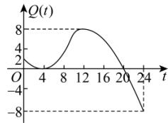
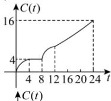
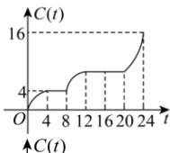
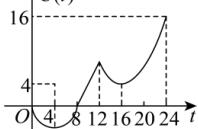
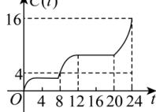

<!-- question-source:start -->
【5】（2024·福建福州高一期中）某市一天内的气温 $Q(t)$ （单位：℃）与时刻t（单位：时）之间的关系如图所示，令 $C(t)$ 表示时间段 $[0,t]$ 内的温差（即时间段 $[0,t]$ 内最高温度与最低温度的差）， $C(t)$ 与t之间的函数关系用下列图象表示，则下列图象最接近的是（）.

A.

B.

C.

D.

<!-- question-source:end -->

![[Q00007556A1]]
