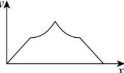
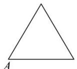
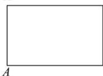
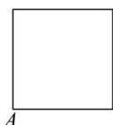
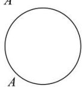

<!-- question-source:start -->
【6】（2024·河南新乡高三阶段练习）已知点 A 为某封闭图形边界上一定点，动点 P 从点 A 出发，沿其边界顺时针匀速运动一周。设点 P 运动的时间为 x，线段 AP 的长度为 y，表示 y 与 x 的函数关系的图象大致如图所示，则该封闭图形可能是（）

A.

B.

C.

D.

<!-- question-source:end -->

![[Q00007557A1]]
