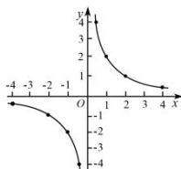
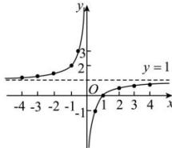
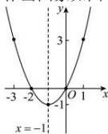
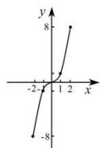
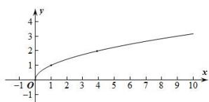
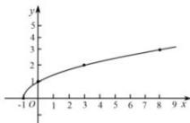
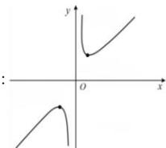

> [!faq]- 全练一本通解析
> **【解析】**
> 图象见解析
> 解析：（1） $f(x)=\frac{2}{x}$ 的定义域为 $\left\{x\mid x\neq0\right\}$ ，值域为 $\left\{y\mid y\neq0\right\}$ 。列表如下：
> <table><tr><td>x</td><td>-2</td><td>-1</td><td> $-\frac{1}{2}$ </td><td> $\frac{1}{2}$ </td><td>1</td><td>2</td></tr><tr><td>f(x)</td><td>-1</td><td>-2</td><td>-4</td><td>4</td><td>2</td><td>1</td></tr></table>
> 
> (2) $f(x) = -\frac{1}{x} + 1$ 的定义域为 $\{x \mid x \neq 0\}$ , 值域为 $\{y \mid y \neq 1\}$ .
> 列表如下:
> <table><tr><td>x</td><td>-4</td><td>-3</td><td>-2</td><td>-1</td><td> $-\frac{1}{2}$ </td><td> $\frac{1}{2}$ </td><td>1</td><td>2</td><td>3</td><td>4</td></tr><tr><td>f(x)</td><td> $\frac{5}{4}$ </td><td> $\frac{4}{3}$ </td><td> $\frac{3}{2}$ </td><td>2</td><td>3</td><td>-1</td><td>0</td><td> $\frac{1}{2}$ </td><td> $\frac{2}{3}$ </td><td> $\frac{3}{4}$ </td></tr></table>
> 作出图象如图：
> 
> 由图知:值域为 $\left\{y \mid y \neq 1\right\}$ ;
> （3） $f(x)=x^{2}+2x$ 的定义域为 R，对称轴为 x=-1，开口向上， $f(x)_{\min}=f(-1)=1-2=-1$ ，所以值域为 $[-1,+\infty)$ ;
> 列表如下:
> <table><tr><td>x</td><td>-3</td><td>-2</td><td>-1</td><td>0</td><td>1</td></tr><tr><td>f(x)</td><td>3</td><td>0</td><td>-1</td><td>0</td><td>3</td></tr></table>
> 作出图象如图:
> 
> (4) $f(x)=x^{3}$ 的定义域为 R，
> 列表如下:
> <table><tr><td>x</td><td>-2</td><td>-1</td><td>0</td><td>1</td><td>2</td></tr><tr><td>f(x)</td><td>-8</td><td>-1</td><td>0</td><td>1</td><td>8</td></tr></table>
> 作出图象如图：
> 
> (5) $f(x)=\sqrt{x}$ 定义域为 $\left[0,+\infty\right)$ ，值域为 $\left[0,+\infty\right)$ .
> 列表如下:
> <table><tr><td>x</td><td>0</td><td>1</td><td>4</td><td>9</td></tr><tr><td>f(x)</td><td>0</td><td>1</td><td>2</td><td>3</td></tr></table>
> 作出其图象如图所示:
> 
> 由图知 $f(x) = \sqrt{x}$ 在 $[0, +\infty)$ 上单调递增， $f(0) = 0$ ，所以值域为 $[0, +\infty)$
> （6） $f(x) = \sqrt{x + 1}$ 的定义域为 $\left[-1, + \infty\right)$ ，值域为 $\left[0, + \infty\right)$ 。列表如下：
> <table><tr><td>x</td><td>-1</td><td>0</td><td>3</td><td>8</td></tr><tr><td>f(x)</td><td>0</td><td>1</td><td>2</td><td>3</td></tr></table>
> 作出其图象如图所示:
> 
> 由图知 $f(x) = \sqrt{x + 1}$ 在 $[-1, +\infty)$ 上单调递增， $f(-1) = 0$ ，所以值域为 $[0, +\infty)$ .
> (7) 列表
> <table><tr><td>x</td><td>-4</td><td>-3</td><td>-2</td><td>-1</td><td> $-\frac{1}{2}$ </td><td> $-\frac{1}{4}$ </td><td> $\frac{1}{4}$ </td><td> $\frac{1}{2}$ </td><td>1</td><td>2</td><td>3</td><td>4</td></tr><tr><td>f(x)</td><td> $-\frac{17}{4}$ </td><td> $-\frac{10}{3}$ </td><td> $-\frac{5}{2}$ </td><td>-2</td><td> $-\frac{5}{2}$ </td><td> $-\frac{17}{4}$ </td><td> $\frac{17}{4}$ </td><td> $\frac{5}{2}$ </td><td>2</td><td> $\frac{5}{2}$ </td><td> $\frac{10}{3}$ </td><td> $\frac{17}{4}$ </td></tr></table>
> 画图：
> 
> 由图可得值域为 $\left(-\infty, -2\right] \cup [2, +\infty)$
