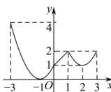
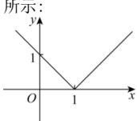
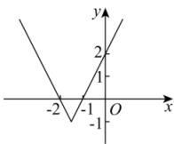
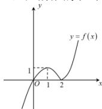
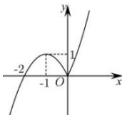
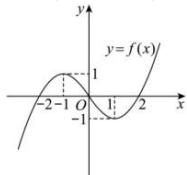
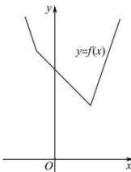

> [!faq]- 全练一本通解析
> **【解析】**
> 详见解析
> 解析：
> （1）当 $-3\leq x < 0$ 时， $f(x) = (x + 1)^{2}$
> 当 $0 \leq x < 1$ 时， $f(x) = x + 1$
> 当 $1 \leq x \leq 3$ 时， $f(x) = (x - 2)^2 + 1$
> 如图，
> 
> 由图可得函数 $f(x)$ 的值域为 $[0,4]$
> (2) $f(x)=\left|x-1\right|=\begin{cases}x-1,&x\geq1\\1-x,&x<1\end{cases}$ ，定义域为R，值域为 $[0,+\infty)$ ，图像如图所示：
> 
> (3) $f(x)=\left|2x+3\right|-1=\left\{\begin{aligned}&2x+2,&x\geq-\frac{3}{2}\\&-4-2x,&x<-\frac{3}{2}\end{aligned}\right.$ 定义域为 R，值域为 $[-1,+\infty)$ .
> 图像如图所示:
> 
> (4) $f(x) = x|x - 2| = \begin{cases} x^2 - 2x, & x > 2 \\ -x^2 + 2x, & x < 2 \end{cases}$ ,
> 画出函数图象如下:
> 
> 由图像可知值域为 R .
> （5）当 x<0 时， $f(x)=-x^{2}-2x$
> 当 $x \geq 0$ 时， $f(x) = x^2 + 2x$
> 所以 $f(x)=\left\{\begin{aligned}x^{2}+2x,x&\geq0\\ -x^{2}-2x,x&<0\end{aligned}\right.$ ，函数图像如图：
> 
> 由图像可知值域为 R .
> (6) $f(x) = x|x| - 2x = \begin{cases} x^2 -2x,x\geq 0\\ -x^2 -2x,x <   0 \end{cases}$
> 则图象如图所示，
> 
> 由图像可知值域为 R .
> (7) 当 x<-1 时， $f(x)=2(2-x)+(-x-1)=-3x+3$ ;
> $$
> - 1 \leq x \leq 2
> $$
> $$
> f (x) = 2 (2 - x) + x + 1 = - x + 5
> $$
> 当 $x > 2$ 时， $f(x) = 2(x - 2) + x + 1 = 3x - 3$ ；
> 故 $f(x) = \begin{cases} -3x + 3, & x < -1 \\ -x + 5, & -1 \leq x \leq 2 \\ 3x - 3, & x \geq 2 \end{cases}$ , 函数图象如图所示:
> 
> 由图像可知值域为 $[3, +\infty)$ 。
> ## 重点题型专练
