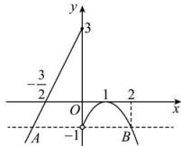

> [!faq]- 全练一本通解析
> **【答案】** A
>
> **【解析】**
> 解析:(方法1)当 $x\leq0$ 时 $f(x)=2x+3$ ，不等式 $f(x)\geq-1$ 可化为 $2x+3\geq-1$ ，解得 $x\geq-2$ 又 $x\leq0$ ，所以 $-2\leq x\leq0$ ;
> 当 x>0 时， $f(x)=-(x-1)^{2}$ ，不等式 $f(x)\geq-1$ 可化为 $-(x-1)^{2}\geq-1$ 解得 $0\leq x\leq2$ 又 x>0，所以 $0<x\leq2$ 综上，使不等式 $f(x)\geq-1$ 成立的 x 的取值范围是 [-2,2]。故选：A.
> （方法2）函数 $f(x)$ 的图象如图所示，虚线表示 y=-1，
> 函数 $f(x)$ 图象在虚线 y=-1 及以上的部分中 x 的取值范围即不等式 $f(x)\geq-1$ 的解集.
> 
> 由图可知，x 的取值范围就是点的横坐标与点 B 的横坐标之间的范围。在 $y=2x+3$ 中，令 y=-1，得 x=-2，所以点 A 的横坐标为 -2。
> 在 $y = -(x - 1)^{2}$ 中，令 y = -1，得 x = 0 （舍去）或 x = 2，
> 所以点 B 的横坐标为 2，所以使不等式 $f(x) \geq -1$ 成立的 x 的取值范围是 $[-2, 2]$ .
>
> 故选 **A**.
