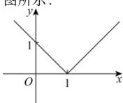
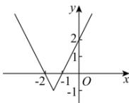
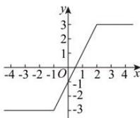
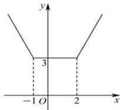
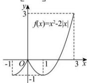

> [!faq]- 全练一本通解析
> **【解析】**
> （1） $[0,+\infty)$ ；（2） $[-1,+\infty)$ ；（3） $[-3,3]$ ；（4） $[3,+\infty)$ ；（5） $[-1,3]$ 。
> 详解：（1） $y=\left|x-1\right|=\left\{\begin{aligned}&x-1,&x\geq1\\&1-x,&x<1\end{aligned}\right.$ ，定义域为 R，值域为 $[0,+\infty)$ ，图像如
> 
> (2) $y = \left| 2x + 3 \right| - 1 = \begin{cases} 2x + 2, & x \geq -\frac{3}{2} \\ -4 - 2x, & x < -\frac{3}{2} \end{cases}$ 定义域为 R，值域为 $[-1, +\infty)$ . 图像
> 
> 
> （3） $y=\left|x+1\right|-\left|x-2\right|=\begin{cases}3,x\geq2\\2x-1,-1<x<2\\-3,x\leq-1\end{cases}$ ，画出函数图像，如图所示：
> 根据图像知，函数值域为 $[-3,3]$ .
> （4）由题意得： $y=\left|x+1\right|+\left|x-2\right|=\begin{cases}-2x+1,x<-1\\3,-1\leq x\leq2\\2x-1,x>2\end{cases}$ 图像如图所示：
> 
> 所以函数的值域为 $[3, +\infty)$
> （5）因为 $y = x^{2} - 2|x| = \begin{cases} x^{2} + 2x, & x \in [-1,0] \\ x^{2} - 2x, & x \in (0,3] \end{cases}$ ，其图像如图所示，由图知，当 $x = -1$ 或 $x = 1$ 时， $y$ 有最小值为 -1，当 $x = 3$ 时， $y$ 有最大值为 3，所以函数的值域为 $[-1,3]$ ，故答案为： $[-1,3]$ .
> 
