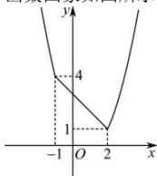

> [!faq]- 全练一本通解析
> **【答案】** 1
>
> **【解析】**
> 当 $-x + 3 \geq (x - 1)^{2}$ ，即 $x^{2} - x - 2 \leq 0$ ，
> 即 $-1 \leq x \leq 2$ 时， $M(x) = -x + 3$ 当当 $-x+3<\left(x-1\right)^{2}$ ， $x^{2}-x-2>0$ ，
> 即 x>2 或 x<-1 时， $M(x)=(x-1)^{2}$ 所以 $M(x)=\left\{\begin{aligned}-x+3,x&\in[-1,2]\\ (x-1)^{2},&x\in(-\infty,-1)\cup(2,+\infty)\end{aligned}\right.$
> 函数图象如图所示:
> 
> 由图可得, 函数 $M(x)$ 在 $(-∞,-1)$ , $(1,2)$ 上递减, 在 $(2,+∞)$ 上递增, 所以 $M(x)_{\min}=M(2)=-2+3=1$ . 故答案为: 1.
