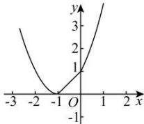

> [!faq]- 全练一本通解析
> **【答案】** B
>
> **【解析】**
> $$
> f (x) \geq g (x)
> $$
> $$
> x + 1 \geq (x + 1) ^ {2}
> $$
> $$
> x ^ {2} + x \leq 0
> $$
> $$
> - 1 \leqslant x \leqslant 0
> $$
> $$
> f (x) <   g (x)
> $$
> $$
> x + 1 <   (x + 1) ^ {2}
> $$
> $$
> x ^ {2} + x > 0
> $$
> $$
> x <   - 1
> $$
> $$
> x > 0
> $$
> $$
> M (x) = \left\{ \begin{array}{l} x + 1, - 1 \leq x \leq 0 \\ (x + 1) ^ {2}, x \langle - 1 \text {或} x \rangle 0 \end{array} . \right.
> $$
> 作出 $M(x)$ 的图象如图所示：
> 
> 由图象可得 $M(x)$ 的最小值为 0.
>
> 故选 **B**.
