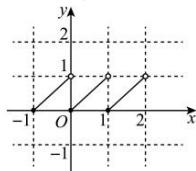

> [!faq]- 全练一本通解析
> **【解析】**
> [0,1) 解析: 当 $-1 \leq x < 0$ 时, $[x] = -1$ , 所以 $f(x) = x + 1$ , 当 $0 \leq x < 1$ 时, $[x] = 0$ , 所以 $f(x) = x$ , 当 $1 \leq x < 2$ 时, $[x] = 1$ , 所以 $f(x) = x - 1$ ,
> 综上 $f(x)=\left\{\begin{aligned}x+1,-1&\leq x<0\\ x,0&\leq x<1\\ x-1,1&\leq x<2\end{aligned}\right.$
> $f(x)$ 图象如图所示：
> 
> 函数 $f(x)$ 的值域是[0,1).
