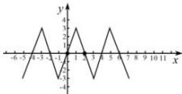
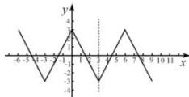
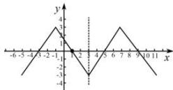
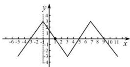
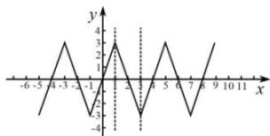
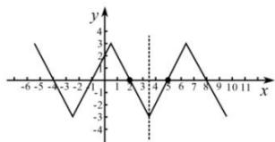
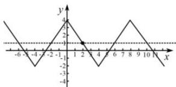
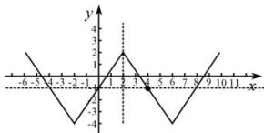
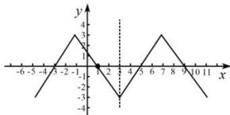
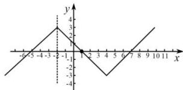

> [!faq]- 全练一本通解析
> **【答案】** 详见解析
>
> **【解析】**
> 解析：（1）因为 $f(x)$ 为奇函数，所以 $f(x)$ 关于 $(0,0)$ 点对称，且满足 $f(4+x)+f(-x)=0$ ，则 $f(x)$ 又关于 $(2,0)$ 点对称，
> 所以周期 $T=2\left|2-0\right|=4$ ，图像如下图.
> 
> （2）因为 $f(x)$ 为偶函数，所以 $f(x)$ 关于 $x = 0$ 轴对称，且满足 $f(4 + x) = f(2 - x)$ ，则 $f(x)$ 又关于 $x = 3$ 轴对称，所以周期 $T = 2|3 - 0| = 6$ ，图像如下图.
> 
> （3） $f(x+1)$ 为奇函数，则 $f(x+1)$ 关于 $(0,0)$ 点对称，而 $f(x+1)$ 是由 $f(x)$ 向左平移一个单位得到，等价于 $f(x)$ 向左平移一个单位关于 $(0,0)$ 点对称， $f(x)$ 则关于 $(1,0)$ 成点对称，且满足 $f(6+x)=f(-x)$ ，则 $f(x)$ 又关于 x=3 轴对称，所以周期 T=4|3-1|=8，图像如下图.
> 
> （4） $f(x-1)$ 为偶函数，则 $f(x-1)$ 关于 x=0 轴对称，而 $f(x-1)$ 是由 $f(x)$ 向右平移一个单位得到，等价于 $f(x)$ 向右平移一个单位关于 x=0 轴对称， $f(x)$ 则关于 x=-1 成轴对称，且满足 $f(x)+f(2-x)=0$ ，则 $f(x)$ 又关于 $(1,0)$ 成点对称，所以周期 $T=4|1-(-1)|=8$ ，图像如下图.
> 
> （5） $f(x+1)$ 为偶函数，则 $f(x+1)$ 关于 x=0 轴对称，而 $f(x+1)$ 是由 $f(x)$ 向左平移一个单位得到，等价于 $f(x)$ 向左平移一个单位关于 x=0 轴对称， $f(x)$ 则关于 x=1 成轴对称，且满足 $f(2+x)-f(4-x)=0$ ，则 $f(x)$ 又关于 x=3 成轴对称，所以周期 $T=2|3-1|=4$ ，图像如下图.
> 
> (6) $f(x + 5)$ 为奇函数, 则 $f(x + 5)$ 关于 $(0,0)$ 点对称, 而 $f(x + 5)$ 是由 $f(x)$ 向左平移 5 个单位得到, 等价于 $f(x)$ 向左平移 5 个单位关于 $(0,0)$ 点对称, $f(x)$ 则关于 $(5,0)$ 成点对称, 且满足 $f(2 + x) = -f(2 - x)$ , 则 $f(x)$ 又关于 $(2,0)$ 成点对称, 所以周期 $T = 2|5 - 2| = 6$ , 图像如下图.
> 
> （7） $f(x)$ 为偶函数, 所以 $f(x)$ 关于 x=0 轴对称, 且满足 $f(-2+x)+f(6-x)=2$ , 则 $f(x)$ 又关于 (2,1) 成点对称, 所以周期 $T=4|2-0|=8$ , 图像如下图.
> 
> （8） $f(x+2)$ 为偶函数，则 $f(x+2)$ 关于 x=0 轴对称，而 $f(x+2)$ 是由 $f(x)$ 向左平移 2 个单位得到，等价于 $f(x)$ 向左平移 2 个单位关于 x=0轴对称， $f(x)$ 则关于 x=2 成轴对称，且满足 $f(x)+f(8-x)=-2$ ，则 $f(x)$ 又关于 $(4,-1)$ 成点对称，所以周期 $T=4|4-2|=8$ ，图像如下图.
> 
> （9） $f(2x+1)$ 为奇函数，则 $f(2x+1)$ 关于 $(0,0)$ 点对称，则 $f(x+1)$ 同样关于 $(0,0)$ 点对称（伸缩变换是横坐标发生倍数变化，原点是 0 所以位置不发生变化），而 $f(x+1)$ 是由 $f(x)$ 向左平移 1 个单位得到，等价于 $f(x)$ 向左平移 1 个单位关于 $(0,0)$ 点对称， $f(x)$ 则关于 $(1,0)$ 成点对称，且满足 $f(8+x)=f(-2-x)$ ，则 $f(x)$ 又关于 x=3 成轴对称，所以周期 $T=4|3-1|=8$ ，图像如下图.
> 
> （10） $f(4x-2)$ 为偶函数，则 $f(4x-2)$ 关于 x=0 轴对称，则 $f(x-2)$ 同样关于 x=0 轴对称（伸缩变换是横坐标发生倍数变化，原点是 0 所以位置不发生变化），而 $f(x-2)$ 是由 $f(x)$ 向右平移 2 个单位得到，等价于 $f(x)$ 向右平移 2 个单位关于 x=0 轴对称， $f(x)$ 则关于 x=-2 成轴对称，且满足 $f(4+x)+f(-2-x)=0$ ，则 $f(x)$ 又关于 (1,0) 成点对称，所以周期 $T=4|-2-1|=12$ ，图像如下图.
> 
