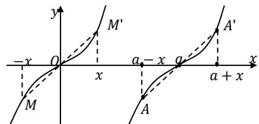

## 2. 中心对称

(1) $f(a+x)+f(a-x)=0\Leftrightarrow$ 函数 $y=f(x)$ 图象关于点 $(a,0)$ 成中心对称；

(2) $f(a + x) + f(a - x) = 2b \Leftrightarrow$ 函数 $y = f(x)$ 图象关于点 $(a, b)$ 成中心对称；

(3) $f(a+x)+f(b-x)=c\Leftrightarrow$ 函数 $y=f(x)$ 图象关于点 $\left(\frac{a+b}{2},\frac{c}{2}\right)$ 成中心对称.

恒等式特征: 函数值的和为常数, 所含 x 的两个系数相反, 可联想奇函数 $f(x) + f(-x) = 0$ .

3. 函数对称性与周期性的关系

（1）若 $f(x)$ 关于点 $(a,0),(b,0)$ 对称，则 $f(x)$ 是周期函数，且 $T=2|a-b|$ ;

（2）若 $f(x)$ 图象有两条对称轴 x=a, x=b，则 $f(x)$ 是周期函数，且 $T=2|a-b|$ ;

（3）若 $f(x)$ 关于点 $(a,0)$ 对称，且关于 x=b 对称，则 $f(x)$ 是周期函数，且 $T=4|a-b|$ ;

注意: 若一个函数 $f(x)$ 具有“①中心对称; ②轴对称; ③周期性”中的任意两个条件, 则第三个也必然成立. 即在①②③中可以“知二求一”. 在客观题中要学会运用图象迅速观察出周期.
