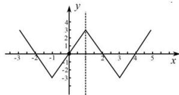

> [!faq]- 全练一本通解析
> **【答案】** C
>
> **【解析】**
> C解析：方法一：对于A中，函数 $f(1 + x)$ 为偶函数，则有 $f(1 + x) = f(1 - x)$ 可得 $f(2 + x) = f(-x)$ ，又由 $f(x)$ 为奇函数，则 $f(-2 - x) = -f(2 + x),f(-x) = -f(x)$ 则有 $f(-2 - x) = -f(-x)$ ，所以 $-f(-2 - x) = -f(x)$ ，即 $f(-2 - x) = f(x)$ 所以A错误；对于B中，函数 $f(1 + x)$ 为偶函数，则有 $f(1 + x) = f(1 - x)$ ，所以B不正确；对于C中，由 $f(2 + x) = f(-x) = -f(x)$ ，则 $f(x + 4) = -f(x + 2) = f(x)$ 所以 $f(x)$ 是周期为4的周期函数，所以 $f(x + 2) = f(x - 2)$ ，所以C正确；对于D中，由 $f(x)$ 是周期为4的周期函数，可得 $f(2023) = f(-1 + 506\times 4) = f(-1) = -f(1)$ ，其中结果不一定为0，所以D错误.故选：C.方法二：函数 $f(1 + x)$ 为偶函数，所以 $f(x)$ 关于 $x = 1$ 成轴对称，又因为 $f(x)$ 为R上的奇函数，所以 $f(x)$ 关于 $(0,0)$ 成点对称，则根据周期结论 $T = 4|1 - 0| = 4$ ，可根据性质画出函数简图：
> 
> 对于 A 中， $f(-2-x)+f(x)=0$ 等价于函数关于 $(-1,0)$ 点对称，由图像可知错误.
> 对于 B 中， $f(-x)=f(1+x)$ 等价于函数关于 $x=\frac{1}{2}$ 成轴对称，由图像可知错误.
> 对于 C 中， $f(x+2)=f(x-2)$ 等价于函数周期为 4，正确
> 对于 D 中，由 $f(x)$ 是周期为 4 的周期函数，可得 $f(2023)=f(-1+506\times4)=f(-1)=-f(1)$ ，由图像可知错误，
>
> 故选 **C**
