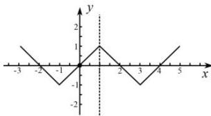

> [!faq]- 全练一本通解析
> **【答案】** BCD
>
> **【解析】**
> 解析：由题设 $f(4-x)=-f(x)=-f(2-x)$ ，则 $f(6-x)=-f(4-x)$ ，
> 所以 $f(6-x)=f(x)$ ，故 x=3 是 $f(x)$ 的一条对称轴，B 对；
> 且 $f(6-x)=f(2-x)\Rightarrow f(x+4)=f(x)$ ，则 $f(x)$ 为周期函数，且周期 T=4，A 错；
> 所以 $f(4-x)=f(-x)=-f(x)$ 且定义域为 R，故 $f(x)$ 为奇函数，C 对； $f(2024)=f(506\times4)=f(0)=f(2-0)=f(2)=0$ ，D 对.
> 故选：BCD
> 方法二：由 $f(x)=f(2-x), f(x)+f(4-x)=0$ 可得函数 $f(x)$ 关于 x=1 对称，关于 $(2,0)$ 成点对称，所以周期为 T=4，当 $1\leq x\leq2$ 时， $f(x)=-x+2$ ，可画出图像：
> 
